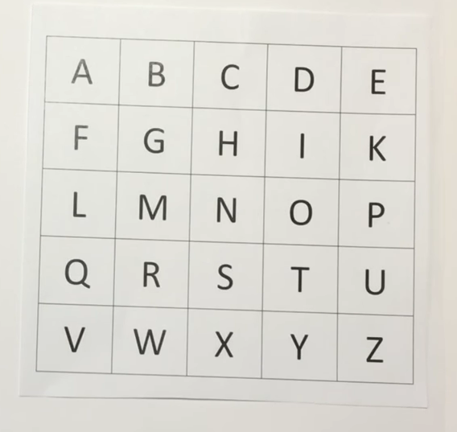

# Playfair Cipher

It was invented in 1854 by [Charles Wheatstone](https://en.wikipedia.org/wiki/Charles_Wheatstone) but was named after [Lord Playfair](https://en.wikipedia.org/wiki/Lord_Playfair) who promoted its use. 

Here, unlike traditional cipher, we **encrypt a pair of alphabets *(bigrams or digrams)*** instead of a single alphabet.

The Playfair cipher uses a 5×5 grid of letters, and encrypts a message  by breaking the text into pairs of letters and swapping them according  to their positions in a rectangle within that grid.

### Steps for Simple Encryption

1. Pick any one of the 26 letters to remove it from the grid so you can have a 5*5 grid.
2. Make a 5*5 grids with the remaining 25 letters in sequence from left to right and top to bottom.
3. From the string you need to encode, recursively select two letters at a time and: 
   1. if they are in the **same row** : replace the letters with the letter directly to the right of them. If a letter is at the end of its row, wrap around to the first letter of the row.
   2. else if they are in the **same column **: replace the letters with the letter directly below them.  If a letter is at the end of its column, wrap around to the first letter of the column.
   3. else if the **2 letters are identical (or if there is only one remaining)** : insert another letter (for example a X or a Q) after the first letter and cipher the new bigram thus formed
   4. else they are on **diagonally opposite corners of a grid** : replace the letters with the letter on the ***horizontally opposite*** end of the grid.

4. Voila! Your message is encrypted.

### Example

Let the message be "Balloon" and the dropped letter be J.

Then the grid would be: 

 

1. Picking B and A, they are in the same row. So replace B by C and A by E.
2. L is repeating, so insert X between them. In `BALXLOON`, L and X are on the corners of a 3*3 grid. Replace L by N, X by V.
3. Next, we have L and O. Replace by M and P.
4. The next O and N are in the same row, so replace them by P and O..
5. The encrypted string is : `CANVMPPO`

**Note: This simple cipher can be further modified to make it harder to crack!**

> For reference,  here's a helpful [video](https://www.youtube.com/watch?v=-KjFbTK1IIw) and a [decoder](https://www.dcode.fr/playfair-cipher).

